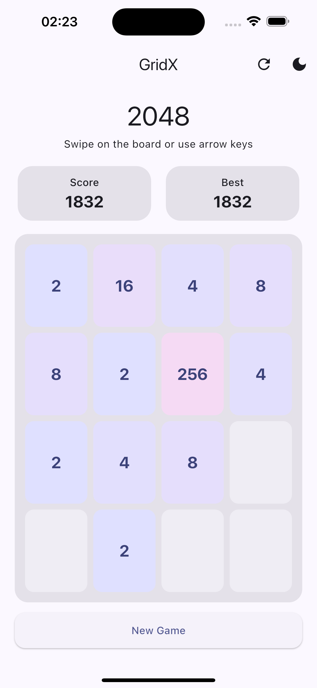
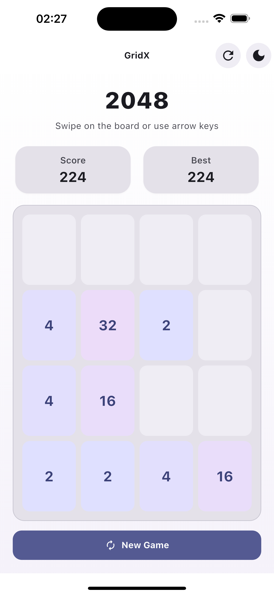
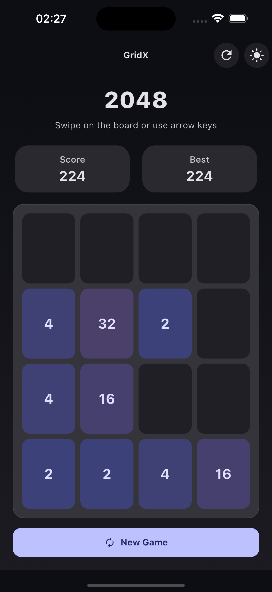

# GridX

GridX is a 2048-inspired puzzle game where you slide tiles on a grid, merge matching numbers, and aim to reach the 2048 tile.

## Getting Started

Run the app locally:

1. Install Flutter SDK
2. Run `flutter pub get`
3. Run `flutter run`

For Flutter docs, see [docs.flutter.dev](https://docs.flutter.dev/).

## Screenshots

Add your app screenshots to `assets/screenshots/` using these names:

- `splash.png`
- `home.png`
- `gameplay.png`

<table>
	<tr>
		<td align="center"><b>Splash</b></td>
		<td align="center"><b>Home</b></td>
		<td align="center"><b>Gameplay</b></td>
	</tr>
	<tr>
		<td></td>
		<td></td>
		<td></td>
	</tr>
</table>
